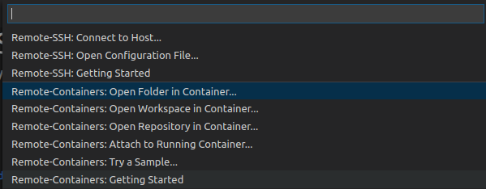
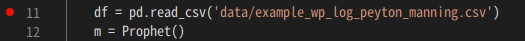
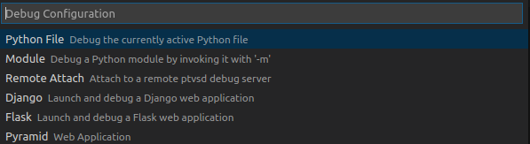
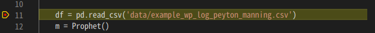

# README for `py3` Repository

- python3 の GPU コンテナ環境
- VS Code 用 のコンテナデバッグ可
- ビルドは、約1時間
    - VS Code 上でビルドする前に、事前にビルドしておいてもよい

## Quick Start

当レポジトリのdocker-compose、Dockerfile によるコンテナ上で Python ファイルをデバッグするための簡易手順

- `Remote-Containers: Open Folder in Container ...` で、当ディレクトリを指定して開く

    

- `ex.py` を開く

- `ex.py` の任意の行にブレークポイントをセット

    

- デバッグを開始(F5)

- デバッグ設定として `Python File` を選択

    

- しばらく待つと、以下のようにブレークポイントで止まればOK

    

- 以降、自由にデバッグができる
